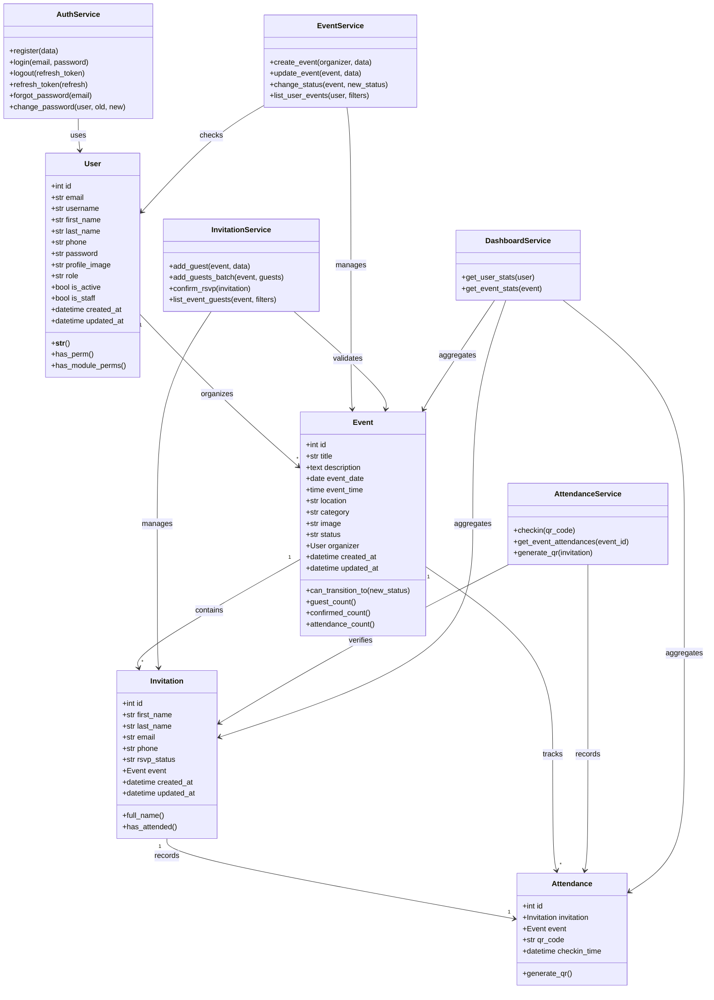
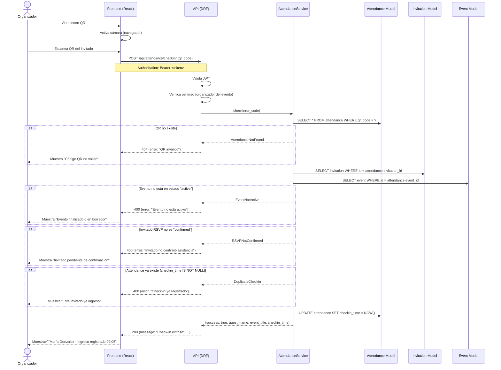
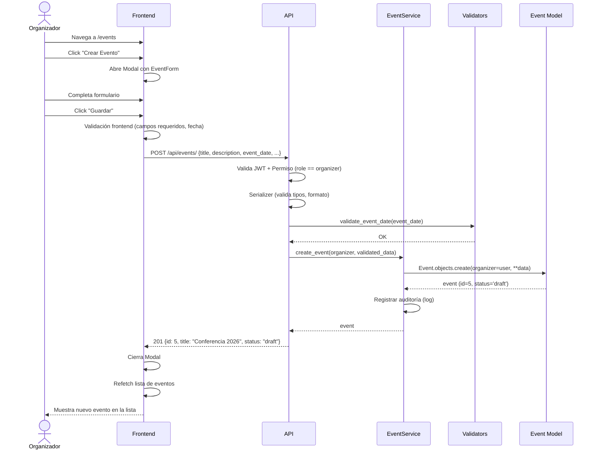

# ARQUITECTURA DEL SISTEMA DE GESTIÓN DE EVENTOS

## 1. VISIÓN GENERAL DEL SISTEMA

```
+------------------------------------------------------------------+
|                        CLIENTE (Navegador)                        |
|  +------------------------------------------------------------+  |
|  |                   FRONTEND (React + Vite)                   |  |
|  |  +----------+ +----------+ +----------+ +----------------+ |  |
|  |  |  Pages   | |Components| |  Context | |  Services      | |  |
|  |  | (Vistas) | | (UI)     | | (Estado) | | (Axios -> API) | |  |
|  |  +----------+ +----------+ +----------+ +----------------+ |  |
|  +------------------------------------------------------------+  |
|                              | HTTP (JSON)                        |
|                              | JWT Bearer Token                   |
+------------------------------------------------------------------+
                               |
+------------------------------------------------------------------+
|                   BACKEND (Django 6.0 + DRF)                      |
|  +------------------------------------------------------------+  |
|  |                     REST API                                |  |
|  |  +-------+ +--------+ +-----------+ +-------+ +---------+  |  |
|  |  | Users | | Events | |Invitations| |Attend.| |Dashboard|  |  |
|  |  |  App  | |  App   | |   App     | | App   | |  App    |  |  |
|  |  +-------+ +--------+ +-----------+ +-------+ +---------+  |  |
|  |  +------------------------------------------------------+  |  |
|  |  |            Capas por App (Arquitectura en Capas)      |  |  |
|  |  |  validators → services → permissions → views → urls   |  |  |
|  |  +------------------------------------------------------+  |  |
|  +------------------------------------------------------------+  |
|                              |                                    |
|                   SQLite (desarrollo)                             |
|                   PostgreSQL (producción futura)                  |
+------------------------------------------------------------------+
```

### 1.1 Principios Arquitectónicos

| Principio | Aplicación |
|-----------|-----------|
| **Separación de responsabilidades** | Cada app Django tiene una responsabilidad única: users = identidad, events = eventos, invitations = invitados, attendance = asistencia, dashboard = estadísticas |
| **Arquitectura en capas** | Cada app Django sigue: validators → services → permissions → views → urls. Separación estricta lógica/presentación en frontend |
| **API-first** | Toda la comunicación frontend ↔ backend viaja por API REST con JSON |
| **DRY** | Lógica compartida se extrae a services, validators reutilizables, hooks personalizados en frontend |
| **Principio de mínima responsabilidad** | Cada archivo tiene un propósito único y claro |
| **Portabilidad BD** | ORM puro sin SQL nativo; SQLite en dev → PostgreSQL en prod con solo cambiar ENGINE |
| **Seguridad por capas** | JWT + permisos por rol + validación por capa (frontend + backend) |

### 1.2 Justificación de Decisiones Arquitectónicas

**¿Por qué Django + DRF y no FastAPI o Flask?**
- Django proporciona ORM maduro, admin panel, sistema de permisos, migrations, y un ecosistema completo. DRF extiende Django con serializers, viewsets, autenticación JWT, y browsable API. Para un sistema empresarial con roles, relaciones complejas y migración futura a PostgreSQL, Django ofrece el stack más completo y probado.

**¿Por qué SQLite y no PostgreSQL desde el inicio?**
- SQLite elimina la sobrecarga operativa durante el desarrollo. Django ORM abstrae completamente la BD, por lo que migrar a PostgreSQL es tan simple como cambiar `ENGINE` y `NAME` en settings.py. No se escribe SQL nativo en ninguna capa.

**¿Por qué React con Vite y no Next.js o CRA?**
- Vite ofrece el mejor DX (hot module replacement rápido, build optimizado). CRA está deprecado. Next.js introduciría complejidad de SSR que este SPA no necesita. React Router maneja el enrutamiento cliente sin necesidad de un framework full-stack.

**¿Por qué JWT y no sesiones?**
- JWT permite autenticación stateless, ideal para API REST. El frontend almacena el token y lo envía en cada petición. Escala horizontalmente sin sticky sessions. Simple para SPA.

**¿Por qué 5 apps separadas y no 2 o 3?**
- Cada dominio de negocio (usuarios, eventos, invitaciones, asistencia, dashboard) tiene ciclos de vida, serializers, permisos y pruebas independientes. Separarlas permite desarrollo paralelo, testing aislado y escalabilidad del equipo. La cohesión es alta dentro de cada app, el acoplamiento entre apps es bajo (solo FK event_id).

**¿Por qué capa `services.py` separada de `views.py`?**
- Las views solo orquestan la petición HTTP (request → response). La lógica de negocio (crear invitado + enviar notificación + registrar auditoría) vive en services. Esto permite reutilizar services desde views, comandos de management, tests, y futuros workers asíncronos.

---

## 2. ARQUITECTURA DEL BACKEND

### 2.1 Estructura de Archivos por App

Cada app Django contiene archivos con responsabilidades claramente definidas:

```
backend/apps/<app>/
├── validators.py    # Validación semántica de datos (no confundir con serializers)
├── services.py      # Lógica de negocio pura (orquestación, transacciones)
├── permissions.py   # Reglas de autorización por rol y contexto
├── serializers.py   # Transformación datos ↔ JSON + validación sintáctica
├── views.py         # Puntos de entrada HTTP (request → response)
├── urls.py          # Enrutamiento específico del módulo
├── admin.py         # Configuración del panel admin
├── models.py        # Definición del modelo de datos
├── filters.py       # Lógica de filtrado y búsqueda (opcional)
├── signals.py       # Reacciones a eventos del modelo (opcional)
├── tasks.py         # Tareas asíncronas futuras
└── tests/
    ├── test_models.py
    ├── test_serializers.py
    ├── test_views.py
    ├── test_services.py
    └── test_permissions.py
```

#### Responsabilidad de cada archivo:

| Archivo | Responsabilidad |
|---------|----------------|
| `validators.py` | Validación semántica de datos: email ya registrado, fecha no pasada, capacidad disponible, estado válido para transición. NO valida formato (eso es del serializer). |
| `services.py` | Lógica de negocio orquestada: crear evento y su invitación por defecto, realizar check-in y actualizar estado, calcular estadísticas del dashboard. Operaciones que involucran múltiples modelos o efectos secundarios. |
| `permissions.py` | Clases de permission DRF: `IsOrganizer`, `IsCollaborator`, `IsEventOwner`, `CanManageGuests`. Evalúan roles y pertenencia. |
| `serializers.py` | Serializadores DRF: validación sintáctica de campos, transformación de tipos, anidamiento, representación JSON. |
| `views.py` | ViewSets DRF: `APIView` o `ViewSet` que aplica permission → llama al service → retorna Response. NO contiene lógica de negocio. |
| `urls.py` | Router DRF que registra endpoints y asigna views. |
| `admin.py` | Registro de modelos en admin de Django con `list_display`, `search_fields`, `list_filter`. |
| `models.py` | Definición de modelos Django con campos, relaciones, `Meta`, `__str__`. |
| `filters.py` | Filtros personalizados para `django-filter` (búsqueda por rango de fechas, estado, etc.). |
| `signals.py` | Señales Django para acciones automáticas: generar QR al crear invitado, actualizar contadores, etc. |
| `tests/` | Tests unitarios y de integración separados por capa. |

### 2.2 Flujo de una Petición Completa

```
Request HTTP
    │
    ▼
[URL Router] ──→ urls.py (enruta al ViewSet)
    │
    ▼
[Authentication] ──→ JWT Authentication (SimpleJWT)
    │
    ▼
[Permissions] ──→ permissions.py (¿puede este rol hacer esto?)
    │
    ▼
[Serializer] ──→ serializers.py (validar y deserializar input)
    │
    ▼
[Validators] ──→ validators.py (validación semántica adicional)
    │
    ▼
[Services] ──→ services.py (ejecutar lógica de negocio)
    │
    ▼
[Database] ──→ models.py (ORM)
    │
    ▼
[Serializer] ──→ serializers.py (serializar output)
    │
    ▼
Response HTTP (JSON)
```

### 2.3 Diagrama de Componentes del Backend

```
┌─────────────────────────────────────────────────────────────┐
│                     DJANGO CONFIG                           │
│  ┌──────────┐ ┌──────────┐ ┌──────────┐ ┌──────────────┐  │
│  │settings  │ │  urls    │ │  asgi    │ │   wsgi       │  │
│  │.py       │ │  .py     │ │  .py     │ │   .py        │  │
│  └──────────┘ └──────────┘ └──────────┘ └──────────────┘  │
│                      │                                       │
│                      ▼                                       │
│  ┌──────────────────────────────────────────────────────┐   │
│  │                 URL ROUTER PRINCIPAL                 │   │
│  │  /api/auth/ → users.urls                            │   │
│  │  /api/users/ → users.urls                           │   │
│  │  /api/events/ → events.urls                         │   │
│  │  /api/invitations/ → invitations.urls               │   │
│  │  /api/attendance/ → attendance.urls                 │   │
│  │  /api/dashboard/ → dashboard.urls                   │   │
│  │  /admin/ → admin.site.urls                          │   │
│  └──────────────────────────────────────────────────────┘   │
└─────────────────────────────────────────────────────────────┘
         │          │          │          │          │
         ▼          ▼          ▼          ▼          ▼
┌──────────┐ ┌──────────┐ ┌──────────┐ ┌──────────┐ ┌──────────┐
│  users   │ │  events  │ │invitation│ │attendance│ │dashboard │
│          │ │          │ │         s│ │          │ │          │
│• Custom  │ │• CRUD    │ │• CRUD    │ │• Checkin │ │• Stats   │
│  User    │ │  Eventos │ │  Invit.  │ │  QR      │ │  Agreg.  │
│• Auth    │ │• Cambio  │ │• Confirm │ │• Hist.   │ │• Próximos│
│  JWT     │ │  Estado  │ │  RSVP    │ │  Asist.  │ │  Eventos │
│• Profile │ │• Filtros │ │• Export. │ │          │ │• Gráficos│
│• Roles   │ │  x fecha │ │          │ │          │ │          │
│• Passwd  │ │          │ │          │ │          │ │          │
│  Reset   │ │          │ │          │ │          │ │          │
└──────────┘ └──────────┘ └──────────┘ └──────────┘ └──────────┘
```

### 2.4 Capas Transversales

```
┌───────────────────────────────────────────────────────────────┐
│                    CAPAS TRANSVERSALES                         │
├───────────────────────────────────────────────────────────────┤
│                                                               │
│  backend/config/                                              │
│  ├── exceptions.py     ← Manejo global de excepciones         │
│  ├── middleware.py     ← Middlewares personalizados (log,     │
│  │                        tiempo de respuesta, headers)       │
│  ├── pagination.py    ← Configuración de paginación global    │
│  ├── swagger.py       ← Configuración drf-spectacular (docs)  │
│  └── validators.py    ← Validadores compartidos (email, RUT)  │
│                                                               │
└───────────────────────────────────────────────────────────────┘
```

### 2.5 Dependencias entre Apps

```
users (app base, sin dependencias)
  │
  ├── events (depende de users → FK organizador)
  │     │
  │     ├── invitations (depende de users + events)
  │     │     │
  │     │     └── attendance (depende de invitations + events)
  │     │
  │     └── dashboard (depende de events, invitations, attendance)
  │
  └── (users no depende de ninguna)
```

**Regla estricta**: Las apps pueden importar modelos de apps superiores (más a la izquierda) pero NO de apps inferiores. events NO importa de attendance. Esto mantiene un DAG (Directed Acyclic Graph) de dependencias.

---

## 3. ARQUITECTURA DEL FRONTEND

### 3.1 Estructura de Archivos

```
frontend/src/
├── assets/            # Recursos estáticos (imágenes, iconos)
│   ├── logo.png
│   ├── default-avatar.png
│   ├── banner.jpg
│   └── ...
│
├── components/        # Componentes reutilizables (sin lógica de página)
│   ├── Navbar.jsx       + Navbar.css
│   ├── Sidebar.jsx      + Sidebar.css
│   ├── EventCard.jsx    + EventCard.css
│   ├── GuestCard.jsx    + GuestCard.css
│   ├── EventForm.jsx    + EventForm.css
│   ├── GuestForm.jsx    + GuestForm.css
│   ├── Modal.jsx        + Modal.css
│   ├── Loading.jsx      + Loading.css
│   ├── Pagination.jsx   + Pagination.css
│   ├── QRReader.jsx     + QRReader.css
│   ├── StatCard.jsx     + StatCard.css
│   └── ProtectedRoute.jsx
│
├── pages/             # Páginas del router (una por ruta)
│   ├── Login.jsx         + Login.css
│   ├── Register.jsx      + Register.css
│   ├── Dashboard.jsx     + Dashboard.css
│   ├── Events.jsx        + Events.css
│   ├── EventDetail.jsx   + EventDetail.css
│   ├── Guests.jsx        + Guests.css
│   ├── Calendar.jsx      + Calendar.css
│   ├── Profile.jsx       + Profile.css
│   └── NotFound.jsx      + NotFound.css
│
├── styles/            # Estilos globales y variables
│   ├── variables.css
│   ├── reset.css
│   └── global.css
│
├── services/          # Capa de comunicación con API (Axios)
│   ├── api.js           ← Instancia Axios (baseURL, interceptors)
│   ├── authService.js   ← login, register, refresh, logout
│   ├── eventService.js  ← CRUD eventos
│   ├── guestService.js  ← CRUD invitados
│   ├── attendanceService.js ← check-in QR
│   └── dashboardService.js  ← estadísticas
│
├── context/           # Estado global (React Context)
│   ├── AuthContext.jsx    ← estado de autenticación + token
│   └── EventContext.jsx   ← estado de evento activo (opcional)
│
├── hooks/             # Custom hooks
│   ├── useAuth.js        ← hook de autenticación
│   ├── useEvents.js      ← hook de eventos
│   ├── useGuests.js      ← hook de invitados
│   └── usePagination.js  ← hook de paginación
│
├── routes/            # Configuración de rutas
│   └── AppRouter.jsx     ← React Router (protegidas/públicas)
│
├── utils/             # Utilidades generales
│   ├── formatters.js     ← formateo de fechas, moneda, etc.
│   ├── validators.js     ← validación de formularios (frontend)
│   └── constants.js      ← constantes (roles, estados)
│
├── validations/       # Esquemas de validación de formularios
│   ├── authValidation.js
│   ├── eventValidation.js
│   └── guestValidation.js
│
├── layouts/           # Layouts reutilizables
│   └── MainLayout.jsx   ← Layout autenticado (Navbar + Sidebar)
│
├── App.jsx            # Componente raíz
└── main.jsx           # Punto de entrada
```

### 3.2 Árbol de Componentes

```
<App>
  ├── <AuthProvider>                         ← Context de autenticación
  │   └── <AppRouter>                        ← Router principal
  │       ├── Ruta pública:
  │       │   └── <Login /> o <Register />
  │       │
  │       └── Rutas protegidas (<ProtectedRoute>):
  │           └── <MainLayout>               ← Navbar + Sidebar
  │               ├── <Dashboard />          ← /dashboard
  │               │   ├── <StatCard /> × N
  │               │   └── <EventCard /> × N
  │               ├── <Events />             ← /events
  │               │   ├── <EventCard /> × N
  │               │   ├── <EventForm />      ← Modal crear/editar
  │               │   └── <Modal />
  │               ├── <EventDetail />        ← /events/:id
  │               │   └── <GuestCard /> × N
  │               ├── <Guests />             ← /events/:id/guests
  │               │   ├── <GuestForm />      ← Modal crear/editar
  │               │   └── <Modal />
  │               ├── <Calendar />           ← /calendar
  │               ├── <Profile />            ← /profile
  │               └── <NotFound />
```

### 3.3 Flujo de Autenticación

```
[Register/Login Page]
    │
    ▼
[AuthContext.login(email, password)]
    │
    ▼
[authService.login()] ─── POST /api/auth/login ───→ [Backend]
    │                                                      │
    │◄────────── { access, refresh, user } ────────────────┘
    │
    ▼
[Almacenar tokens en localStorage/memory]
    │
    ▼
[Redirigir a /dashboard]
    │
    ▼
[Cada petición: axios interceptor agrega Authorization: Bearer <access>]
    │
    ▼
[Si 401 → intentar refresh → si falla → logout]
```

### 3.4 Manejo de Estado Global vs Local

| Estado | Lugar | Razón |
|--------|-------|-------|
| Usuario autenticado + tokens | AuthContext | Necesario en toda la app |
| Lista de eventos | Local en Events.jsx | Solo necesario en esa página |
| Detalle de evento actual | Local en EventDetail.jsx | Solo necesario ahí |
| Lista de invitados | Local en Guests.jsx | Solo necesario ahí |
| Estadísticas dashboard | Local en Dashboard.jsx | Solo necesario ahí |
| Modal abierto/cerrado | Local en el componente | Solo necesario ahí |
| Formulario datos | Local en el formulario | Solo necesario ahí |

### 3.5 Patrón de Servicios (Axios)

```javascript
// services/api.js
import axios from 'axios';

const api = axios.create({
  baseURL: import.meta.env.VITE_API_URL || 'http://localhost:8000/api',
  headers: { 'Content-Type': 'application/json' },
});

// Interceptor de request: adjuntar JWT
api.interceptors.request.use((config) => {
  const token = localStorage.getItem('access_token');
  if (token) config.headers.Authorization = `Bearer ${token}`;
  return config;
});

// Interceptor de response: refresh automático
api.interceptors.response.use(
  (response) => response,
  async (error) => {
    if (error.response?.status === 401 && !error.config._retry) {
      error.config._retry = true;
      // Lógica de refresh token
    }
    return Promise.reject(error);
  }
);

export default api;
```

---

## 4. DISEÑO DE BASE DE DATOS

### 4.1 Diagrama Entidad-Relación (Mermaid)

```mermaid
erDiagram
    User ||--o{ Event : organizes
    User ||--o{ Event : collaborates
    Event ||--o{ Invitation : contains
    Invitation ||--o| Attendance : records
    Event ||--o{ Attendance : tracks

    User {
        int id PK
        string email UK
        string username UK
        string first_name
        string last_name
        string phone
        string password
        string profile_image
        enum role "admin|organizer|collaborator"
        bool is_active
        bool is_staff
        datetime created_at
        datetime updated_at
    }

    Event {
        int id PK
        string title
        text description
        date event_date
        time event_time
        string location
        string category
        string image
        enum status "draft|active|finished"
        int organizer_id FK
        datetime created_at
        datetime updated_at
    }

    Invitation {
        int id PK
        string first_name
        string last_name
        string email
        string phone
        enum rsvp_status "pending|confirmed|rejected"
        int event_id FK
        datetime created_at
        datetime updated_at
    }

    Attendance {
        int id PK
        int invitation_id FK UK
        int event_id FK
        string qr_code UK
        datetime checkin_time
    }
```

### 4.2 Modelo Relacional

```
USUARIOS (User)
═══════════════════════════════════════════════════════
id                  INTEGER       PK, AUTOINCREMENT
email               VARCHAR(254)  NOT NULL, UNIQUE, INDEX
username            VARCHAR(150)  NOT NULL, UNIQUE, INDEX
first_name          VARCHAR(150)  NOT NULL
last_name           VARCHAR(150)  NOT NULL
phone               VARCHAR(20)   NULL
password            VARCHAR(128)  NOT NULL  (hash)
profile_image       VARCHAR(100)  NULL  (ruta archivo)
role                VARCHAR(20)   NOT NULL, DEFAULT 'organizer'
                                    CHECK IN ('admin','organizer','collaborator')
is_active           BOOLEAN       NOT NULL, DEFAULT TRUE
is_staff            BOOLEAN       NOT NULL, DEFAULT FALSE
created_at          DATETIME      NOT NULL, auto_now_add
updated_at          DATETIME      NOT NULL, auto_now

Índices:
- PRIMARY KEY (id)
- UNIQUE INDEX idx_user_email (email)
- UNIQUE INDEX idx_user_username (username)
- INDEX idx_user_role (role)
───────────────────────────────────────────────────────

EVENTOS (Event)
═══════════════════════════════════════════════════════
id                  INTEGER       PK, AUTOINCREMENT
title               VARCHAR(200)  NOT NULL
description         TEXT          NULL
event_date          DATE          NOT NULL, INDEX
event_time          TIME          NULL
location            VARCHAR(255)  NULL
category            VARCHAR(100)  NULL, INDEX
image               VARCHAR(100)  NULL  (ruta archivo)
status              VARCHAR(20)   NOT NULL, DEFAULT 'draft'
                                    CHECK IN ('draft','active','finished')
organizer_id        INTEGER       NOT NULL, FK → User(id)
                                      ON DELETE CASCADE
created_at          DATETIME      NOT NULL, auto_now_add
updated_at          DATETIME      NOT NULL, auto_now

Índices:
- PRIMARY KEY (id)
- INDEX idx_event_date (event_date)
- INDEX idx_event_status (status)
- INDEX idx_event_category (category)
- INDEX idx_event_organizer (organizer_id)
- FOREIGN KEY (organizer_id) REFERENCES User(id)
───────────────────────────────────────────────────────

INVITACIONES (Invitation)
═══════════════════════════════════════════════════════
id                  INTEGER       PK, AUTOINCREMENT
first_name          VARCHAR(150)  NOT NULL
last_name           VARCHAR(150)  NOT NULL
email               VARCHAR(254)  NOT NULL
phone               VARCHAR(20)   NULL
rsvp_status         VARCHAR(20)   NOT NULL, DEFAULT 'pending'
                                    CHECK IN ('pending','confirmed','rejected')
event_id            INTEGER       NOT NULL, FK → Event(id)
                                      ON DELETE CASCADE
created_at          DATETIME      NOT NULL, auto_now_add
updated_at          DATETIME      NOT NULL, auto_now

Índices:
- PRIMARY KEY (id)
- INDEX idx_invitation_event (event_id)
- INDEX idx_invitation_rsvp (rsvp_status)
- INDEX idx_invitation_email (email)
- UNIQUE INDEX idx_event_email (event_id, email)  ← un invitado por email por evento
- FOREIGN KEY (event_id) REFERENCES Event(id)
───────────────────────────────────────────────────────

ASISTENCIA (Attendance)
═══════════════════════════════════════════════════════
id                  INTEGER       PK, AUTOINCREMENT
invitation_id       INTEGER       NOT NULL, UNIQUE, FK → Invitation(id)
                                      ON DELETE CASCADE
event_id            INTEGER       NOT NULL, FK → Event(id)
                                      ON DELETE CASCADE
qr_code             VARCHAR(255)  NOT NULL, UNIQUE, INDEX
checkin_time        DATETIME      NOT NULL, auto_now_add

Índices:
- PRIMARY KEY (id)
- UNIQUE INDEX idx_attendance_invitation (invitation_id)
- UNIQUE INDEX idx_qr_code (qr_code)
- INDEX idx_attendance_event (event_id)
- FOREIGN KEY (invitation_id) REFERENCES Invitation(id)
- FOREIGN KEY (event_id) REFERENCES Event(id)
```

### 4.3 Explicación de Tablas

| Tabla | Propósito |
|-------|-----------|
| **User** | Almacena usuarios del sistema con roles (admin, organizer, collaborator). Usa AbstractBaseUser + PermissionsMixin para un modelo 100% personalizado. |
| **Event** | Almacena eventos creados por organizadores. Cada evento tiene un ciclo de vida: draft → active → finished. |
| **Invitation** | Almacena invitados de cada evento. El RSVP (pending/confirmed/rejected) permite trackear confirmaciones. |
| **Attendance** | Almacena el registro de check-in. La relación 1:1 con Invitation garantiza que un invitado solo puede hacer check-in una vez. El QR único permite escaneo y verificación. |

### 4.4 Explicación de Relaciones

| Relación | Tipo | Explicación |
|----------|------|-------------|
| User → Event | 1:N | Un usuario (organizador) puede tener muchos eventos. Cada evento pertenece a exactamente un organizador. |
| Event → Invitation | 1:N | Un evento puede tener muchas invitaciones. Cada invitación pertenece a exactamente un evento. |
| Invitation → Attendance | 1:1 | Una invitación puede generar máximo un registro de asistencia (check-in). Esto evita duplicados de QR. |
| Event → Attendance | 1:N | Un evento puede tener muchos registros de asistencia (para consultas agregadas). |

### 4.5 Restricciones y Reglas de Negocio

1. **Unicidad email en Invitation por Evento**: `UNIQUE(event_id, email)` — un mismo email no puede ser invitado dos veces al mismo evento.
2. **Unicidad QR en Attendance**: `UNIQUE(qr_code)` — cada QR es único a nivel global.
3. **Unicidad Invitation en Attendance**: `UNIQUE(invitation_id)` — un invitado solo puede hacer check-in una vez.
4. **Validación de Estado**: Los estados de Event tienen transiciones válidas: `draft → active → finished`. No se permiten saltos ni retrocesos.
5. **Fecha de evento**: La fecha del evento no puede ser anterior a la fecha actual al crearlo (validación en backend).
6. **Check-in**: Solo se permite si el evento está en estado `active` y el invitado tiene RSVP `confirmed`.

### 4.6 Migración a PostgreSQL

Para migrar a PostgreSQL solo se necesita:

```python
# config/settings.py (producción)
DATABASES = {
    'default': {
        'ENGINE': 'django.db.backends.postgresql',
        'NAME': os.environ.get('DB_NAME'),
        'USER': os.environ.get('DB_USER'),
        'PASSWORD': os.environ.get('DB_PASSWORD'),
        'HOST': os.environ.get('DB_HOST'),
        'PORT': os.environ.get('DB_PORT', '5432'),
    }
}
```

No se requiere migración de modelos porque Django ORM es agnóstico a la base de datos.

---

## 5. DISEÑO DE API REST

### 5.1 Especificación Completa de Endpoints

#### 5.1.1 Autenticación (`/api/auth/`)

```
POST /api/auth/register/
┌──────────────────────────────────────────────────────────────┐
│ Request:                                                     │
│ {                                                            │
│   "email": "usuario@ejemplo.com",                            │
│   "username": "usuario123",                                  │
│   "password": "Str0ngP@ss!",                                 │
│   "password_confirm": "Str0ngP@ss!",                         │
│   "first_name": "Juan",                                      │
│   "last_name": "Pérez",                                      │
│   "phone": "+56912345678"                                    │
│ }                                                            │
│                                                              │
│ Response 201:                                                │
│ {                                                            │
│   "id": 1,                                                   │
│   "email": "usuario@ejemplo.com",                            │
│   "username": "usuario123",                                  │
│   "first_name": "Juan",                                      │
│   "last_name": "Pérez",                                      │
│   "role": "organizer",                                       │
│   "created_at": "2026-05-31T10:00:00Z"                       │
│ }                                                            │
│                                                              │
│ Validaciones:                                                │
│ - email: formato válido, único en BD, máximo 254 chars       │
│ - username: alfanumérico, 4-150 chars, único en BD           │
│ - password: mínimo 8 chars, 1 mayúscula, 1 número           │
│ - password_confirm: debe coincidir con password              │
│ - phone: opcional, formato válido (+569 prefix)              │
│                                                              │
│ Permisos: Público (sin autenticación)                        │
└──────────────────────────────────────────────────────────────┘

POST /api/auth/login/
┌──────────────────────────────────────────────────────────────┐
│ Request:                                                     │
│ {                                                            │
│   "email": "usuario@ejemplo.com",                            │
│   "password": "Str0ngP@ss!"                                  │
│ }                                                            │
│                                                              │
│ Response 200:                                                │
│ {                                                            │
│   "access": "eyJhbGciOiJIUzI1NiIs...",                      │
│   "refresh": "eyJhbGciOiJIUzI1NiIs...",                      │
│   "user": {                                                  │
│     "id": 1,                                                 │
│     "email": "usuario@ejemplo.com",                          │
│     "username": "usuario123",                                │
│     "first_name": "Juan",                                    │
│     "last_name": "Pérez",                                    │
│     "role": "organizer",                                     │
│     "profile_image": null                                    │
│   }                                                          │
│ }                                                            │
│                                                              │
│ Permisos: Público                                            │
└──────────────────────────────────────────────────────────────┘

POST /api/auth/logout/
┌──────────────────────────────────────────────────────────────┐
│ Request:                                                     │
│ { "refresh": "eyJhbGciOiJIUzI1NiIs..." }                    │
│                                                              │
│ Response 205: (sin contenido)                                │
│                                                              │
│ Permisos: Autenticado                                        │
│ Acción: Invalida el refresh token (blacklist)                │
└──────────────────────────────────────────────────────────────┘

POST /api/auth/refresh/
┌──────────────────────────────────────────────────────────────┐
│ Request:                                                     │
│ { "refresh": "eyJhbGciOiJIUzI1NiIs..." }                    │
│                                                              │
│ Response 200:                                                │
│ { "access": "eyJhbGciOiJIUzI1NiIs..." }                     │
│                                                              │
│ Permisos: Público (requiere refresh token válido)            │
└──────────────────────────────────────────────────────────────┘

POST /api/auth/forgot-password/
┌──────────────────────────────────────────────────────────────┐
│ Request:                                                     │
│ { "email": "usuario@ejemplo.com" }                           │
│                                                              │
│ Response 200:                                                │
│ { "message": "Si el email existe, recibirás instrucciones" } │
│                                                              │
│ Permisos: Público                                            │
│ Nota: No revelar si el email existe o no (seguridad)         │
└──────────────────────────────────────────────────────────────┘

POST /api/auth/change-password/
┌──────────────────────────────────────────────────────────────┐
│ Request:                                                     │
│ {                                                            │
│   "old_password": "Str0ngP@ss!",                             │
│   "new_password": "NuevaP@ss123",                            │
│   "new_password_confirm": "NuevaP@ss123"                     │
│ }                                                            │
│                                                              │
│ Response 200:                                                │
│ { "message": "Contraseña actualizada exitosamente" }         │
│                                                              │
│ Permisos: Autenticado                                        │
└──────────────────────────────────────────────────────────────┘
```

#### 5.1.2 Usuarios/Perfil (`/api/users/`)

```
GET /api/users/profile/
┌──────────────────────────────────────────────────────────────┐
│ Response 200:                                                │
│ {                                                            │
│   "id": 1,                                                   │
│   "email": "usuario@ejemplo.com",                            │
│   "username": "usuario123",                                  │
│   "first_name": "Juan",                                      │
│   "last_name": "Pérez",                                      │
│   "phone": "+56912345678",                                   │
│   "profile_image": "/media/profiles/avatar.jpg",             │
│   "role": "organizer",                                       │
│   "is_active": true,                                         │
│   "created_at": "2026-05-31T10:00:00Z",                      │
│   "updated_at": "2026-05-31T10:00:00Z"                       │
│ }                                                            │
│ Permisos: Autenticado                                        │
└──────────────────────────────────────────────────────────────┘

PUT /api/users/profile/
┌──────────────────────────────────────────────────────────────┐
│ Request (multipart/form-data):                               │
│ {                                                            │
│   "first_name": "Juan Carlos",                               │
│   "last_name": "Pérez González",                             │
│   "phone": "+56998765432",                                   │
│   "profile_image": <archivo>                                 │
│ }                                                            │
│                                                              │
│ Response 200: (perfil actualizado)                           │
│                                                              │
│ Permisos: Autenticado                                        │
│ Nota: email y username no se pueden cambiar                  │
└──────────────────────────────────────────────────────────────┘
```

#### 5.1.3 Eventos (`/api/events/`)

```
GET /api/events/
┌──────────────────────────────────────────────────────────────┐
│ Query params: ?status=active&category=conference&page=1      │
│               &search=texto&ordering=-event_date              │
│                                                              │
│ Response 200:                                                │
│ {                                                            │
│   "count": 25,                                               │
│   "next": "/api/events/?page=2",                             │
│   "previous": null,                                          │
│   "results": [                                               │
│     {                                                        │
│       "id": 1,                                               │
│       "title": "Conferencia de Tecnología 2026",             │
│       "description": "Evento sobre...",                      │
│       "event_date": "2026-06-15",                            │
│       "event_time": "09:00:00",                              │
│       "location": "Santiago, Chile",                         │
│       "category": "conference",                              │
│       "image": "/media/events/banner.jpg",                   │
│       "status": "active",                                    │
│       "organizer": { "id": 1, "username": "usuario123" },    │
│       "guest_count": 45,                                     │
│       "confirmed_count": 30,                                 │
│       "created_at": "2026-05-01T10:00:00Z"                   │
│     }                                                        │
│   ]                                                          │
│ }                                                            │
│                                                              │
│ Permisos: Autenticado                                        │
│ Filtro: Solo eventos del usuario autenticado                 │
└──────────────────────────────────────────────────────────────┘

POST /api/events/
┌──────────────────────────────────────────────────────────────┐
│ Request:                                                     │
│ {                                                            │
│   "title": "Conferencia de Tecnología 2026",                 │
│   "description": "Evento sobre nuevas tecnologías...",       │
│   "event_date": "2026-06-15",                                │
│   "event_time": "09:00",                                     │
│   "location": "Santiago, Chile",                             │
│   "category": "conference",                                  │
│   "image": <archivo>,                                        │
│   "status": "draft"                                          │
│ }                                                            │
│                                                              │
│ Response 201: (evento creado)                                │
│                                                              │
│ Validaciones:                                                │
│ - title: obligatorio, 3-200 chars                            │
│ - event_date: obligatorio, no anterior a hoy                 │
│ - status: defecto "draft", solo transiciones válidas         │
│                                                              │
│ Permisos: Autenticado, role=organizer o admin                │
└──────────────────────────────────────────────────────────────┘

GET /api/events/{id}/
┌──────────────────────────────────────────────────────────────┐
│ Response 200: (detalle del evento con todos los campos)      │
│                                                              │
│ Permisos: Autenticado, propietario del evento o colaborador  │
└──────────────────────────────────────────────────────────────┘

PUT /api/events/{id}/
┌──────────────────────────────────────────────────────────────┐
│ Request: (mismos campos que POST, todos opcionales en PUT)   │
│                                                              │
│ Response 200: (evento actualizado)                           │
│                                                              │
│ Permisos: Autenticado, solo organizador del evento o admin   │
└──────────────────────────────────────────────────────────────┘

DELETE /api/events/{id}/
┌──────────────────────────────────────────────────────────────┐
│ Response 204: (sin contenido)                                │
│                                                              │
│ Permisos: Autenticado, solo organizador del evento o admin   │
│ Efecto: Cascada → elimina invitaciones y asistencias relacionadas │
└──────────────────────────────────────────────────────────────┘
```

#### 5.1.4 Invitados (`/api/invitations/`)

```
GET /api/invitations/?event={event_id}&rsvp_status=confirmed
┌──────────────────────────────────────────────────────────────┐
│ Response 200:                                                │
│ {                                                            │
│   "count": 45,                                               │
│   "results": [                                               │
│     {                                                        │
│       "id": 1,                                               │
│       "first_name": "María",                                 │
│       "last_name": "González",                               │
│       "email": "maria@ejemplo.com",                          │
│       "phone": "+56911111111",                               │
│       "rsvp_status": "confirmed",                            │
│       "event_id": 1,                                         │
│       "event_title": "Conferencia de Tecnología 2026",       │
│       "attended": true,                                      │
│       "created_at": "2026-05-15T10:00:00Z"                   │
│     }                                                        │
│   ]                                                          │
│ }                                                            │
│                                                              │
│ Permisos: Autenticado, propietario del evento                │
│ Filtros: event_id (obligatorio), rsvp_status, search         │
└──────────────────────────────────────────────────────────────┘

POST /api/invitations/
┌──────────────────────────────────────────────────────────────┐
│ Request (single):                                            │
│ {                                                            │
│   "event_id": 1,                                             │
│   "first_name": "María",                                     │
│   "last_name": "González",                                   │
│   "email": "maria@ejemplo.com",                              │
│   "phone": "+56911111111"                                    │
│ }                                                            │
│                                                              │
│ Request (batch):                                             │
│ {                                                            │
│   "event_id": 1,                                             │
│   "guests": [                                                │
│     { "first_name": "...", "last_name": "...", ... },        │
│     { "first_name": "...", "last_name": "...", ... }         │
│   ]                                                          │
│ }                                                            │
│                                                              │
│ Response 201: (invitado(s) creado(s))                        │
│                                                              │
│ Validaciones:                                                │
│ - email único por evento                                     │
│ - evento debe existir y pertenecer al usuario               │
│ - evento debe estar en estado "active" o "draft"            │
│                                                              │
│ Permisos: Autenticado, organizador del evento                │
└──────────────────────────────────────────────────────────────┘

PUT /api/invitations/{id}/
┌──────────────────────────────────────────────────────────────┐
│ Request: (campos editables)                                  │
│                                                              │
│ Response 200: (invitado actualizado)                         │
│                                                              │
│ Permisos: Autenticado, organizador del evento                │
└──────────────────────────────────────────────────────────────┘

DELETE /api/invitations/{id}/
┌──────────────────────────────────────────────────────────────┐
│ Response 204: (sin contenido)                                │
│                                                              │
│ Permisos: Autenticado, organizador del evento                │
└──────────────────────────────────────────────────────────────┘
```

#### 5.1.5 Asistencia (`/api/attendance/`)

```
POST /api/attendance/checkin/
┌──────────────────────────────────────────────────────────────┐
│ Request:                                                     │
│ { "qr_code": "abc123-qr-unique-code-xyz" }                  │
│                                                              │
│ Response 200:                                                │
│ {                                                            │
│   "message": "Check-in exitoso",                             │
│   "invitation": "María González",                            │
│   "event": "Conferencia de Tecnología 2026",                 │
│   "checkin_time": "2026-06-15T09:05:00Z"                     │
│ }                                                            │
│                                                              │
│ Response 400 (check-in duplicado):                           │
│ { "error": "Este invitado ya realizó check-in" }             │
│                                                              │
│ Response 400 (invitado no confirmado):                       │
│ { "error": "El invitado debe confirmar asistencia primero" } │
│                                                              │
│ Response 400 (evento no activo):                             │
│ { "error": "El evento no está activo" }                      │
│                                                              │
│ Permisos: Autenticado, organizador del evento                │
└──────────────────────────────────────────────────────────────┘

GET /api/attendance/?event_id={event_id}
┌──────────────────────────────────────────────────────────────┐
│ Response 200:                                                │
│ {                                                            │
│   "count": 25,                                               │
│   "results": [                                               │
│     {                                                        │
│       "id": 1,                                               │
│       "invitation_id": 1,                                    │
│       "guest_name": "María González",                        │
│       "event_id": 1,                                         │
│       "qr_code": "abc123...",                                │
│       "checkin_time": "2026-06-15T09:05:00Z"                 │
│     }                                                        │
│   ]                                                          │
│ }                                                            │
│                                                              │
│ Permisos: Autenticado, organizador del evento                │
└──────────────────────────────────────────────────────────────┘
```

#### 5.1.6 Dashboard (`/api/dashboard/`)

```
GET /api/dashboard/stats/
┌──────────────────────────────────────────────────────────────┐
│ Response 200:                                                │
│ {                                                            │
│   "total_events": 12,                                        │
│   "active_events": 5,                                        │
│   "finished_events": 4,                                      │
│   "draft_events": 3,                                         │
│   "upcoming_events": [                                       │
│     {                                                        │
│       "id": 1,                                               │
│       "title": "Conferencia Tecnología",                     │
│       "event_date": "2026-06-15",                            │
│       "guest_count": 45,                                     │
│       "confirmed_count": 30                                  │
│     },                                                       │
│     ...                                                      │
│   ],                                                         │
│   "total_guests": 320,                                       │
│   "confirmed_guests": 210,                                   │
│   "pending_guests": 80,                                      │
│   "rejected_guests": 30,                                     │
│   "total_attendances": 150,                                  │
│   "attendance_rate": 71.4,                                   │
│   "events_by_category": {                                    │
│     "conference": 5,                                         │
│     "workshop": 4,                                           │
│     "networking": 3                                          │
│   },                                                         │
│   "events_by_month": {                                       │
│     "2026-01": 2,                                            │
│     "2026-02": 3,                                            │
│     ...                                                      │
│   }                                                          │
│ }                                                            │
│                                                              │
│ Permisos: Autenticado                                        │
│ Nota: Las estadísticas son del usuario autenticado           │
└──────────────────────────────────────────────────────────────┘
```

### 5.2 Códigos de Estado HTTP

| Código | Uso |
|--------|-----|
| **200 OK** | GET, PUT exitosos |
| **201 Created** | POST exitoso |
| **204 No Content** | DELETE exitoso |
| **205 Reset Content** | Logout exitoso |
| **400 Bad Request** | Error de validación (formato, datos inválidos) |
| **401 Unauthorized** | Token faltante, inválido o expirado |
| **403 Forbidden** | Autenticado pero sin permiso para esta acción |
| **404 Not Found** | Recurso no existe |
| **409 Conflict** | Violación de unicidad (email duplicado en evento) |
| **429 Too Many Requests** | Rate limiting excedido |
| **500 Internal Server Error** | Error inesperado del servidor |

### 5.3 Formato de Errores (Estandarizado)

```json
{
  "error": true,
  "message": "Error de validación",
  "code": "VALIDATION_ERROR",
  "details": {
    "email": ["Este campo es obligatorio."],
    "event_date": ["La fecha no puede ser anterior a hoy."]
  }
}
```

---

## 6. ARQUITECTURA DE SEGURIDAD

### 6.1 JWT Authentication (django-rest-framework-simplejwt)

```
┌──────────────┐         ┌──────────────┐         ┌──────────────┐
│   Frontend   │         │   Backend    │         │    JWT       │
│              │         │              │         │              │
│ POST /login  │────────►│ Verificar    │         │              │
│              │         │ credenciales │         │              │
│              │         │      │       │         │              │
│              │         │      ▼       │         │              │
│              │         │ Generar      │────────►│ access: 15min│
│              │         │ tokens       │◄────────│ refresh: 7d  │
│              │◄────────│              │         │              │
│ Almacenar    │         │              │         │              │
│ en localStorage         │              │         │              │
│              │         │              │         │              │
│ GET /events  │────────►│ Validar JWT  │────────►│ Verificar    │
│ Authorization│         │ en interceptor│        │ firma + exp  │
│ Bearer xxx   │         │              │         │              │
│              │◄────────│ Response      │         │              │
└──────────────┘         └──────────────┘         └──────────────┘
```

**Configuración:**
```python
SIMPLE_JWT = {
    'ACCESS_TOKEN_LIFETIME': timedelta(minutes=30),
    'REFRESH_TOKEN_LIFETIME': timedelta(days=7),
    'ROTATE_REFRESH_TOKENS': True,
    'BLACKLIST_AFTER_ROTATION': True,
    'AUTH_HEADER_TYPES': ('Bearer',),
    'AUTH_TOKEN_CLASSES': ('rest_framework_simplejwt.tokens.AccessToken',),
}
```

### 6.2 Sistema de Permisos por Rol (RBAC)

```
                    ┌──────────────┐
                    │   ADMIN      │
                    │ (superadmin) │
                    └──────┬───────┘
                           │
              Todo el sistema (CRUD completo)
                           │
              ┌────────────┴────────────┐
              │                         │
     ┌────────▼───────┐       ┌────────▼────────┐
     │  ORGANIZER     │       │  COLLABORATOR   │
     │ (crea eventos) │       │ (asiste eventos) │
     └────────┬───────┘       └────────┬────────┘
              │                         │
     - CRUD propios eventos    - Ver eventos asignados
     - CRUD invitados          - Gestionar invitados
     - Check-in QR             - Ver estadísticas
     - Dashboard completo      - NO crear eventos
     - NO gestionar otros      - NO eliminar
       organizadores           - NO check-in
```

**Matriz de Permisos:**

| Acción | Admin | Organizer | Collaborator |
|--------|-------|-----------|--------------|
| CRUD cualquier evento | ✅ | ❌ | ❌ |
| CRUD eventos propios | ✅ | ✅ | ❌ |
| Ver eventos asignados | ✅ | ✅ | ✅ |
| CRUD invitados | ✅ | ✅ (propios) | ✅ (asignados) |
| Check-in QR | ✅ | ✅ | ❌ |
| Dashboard stats | ✅ (global) | ✅ (propios) | ❌ |
| Gestionar usuarios | ✅ | ❌ | ❌ |
| Cambiar rol usuario | ✅ | ❌ | ❌ |
| Ver perfil propio | ✅ | ✅ | ✅ |
| Editar perfil propio | ✅ | ✅ | ✅ |

### 6.3 Medidas de Seguridad OWASP

| Medida | Implementación |
|--------|----------------|
| **XSS** | React escapa HTML por defecto. CSP headers en backend. No usar `dangerouslySetInnerHTML` |
| **CSRF** | JWT en headers (`Authorization: Bearer`), no en cookies. CSRF no aplica con este patrón |
| **SQL Injection** | Django ORM parametriza todas las queries. No raw SQL |
| **Clickjacking** | `X-Frame-Options: DENY` |
| **Rate Limiting** | `django-ratelimit` en endpoints sensibles (login, register) |
| **Password Hashing** | Argon2 (configurado en settings.py) |
| **HTTPS** | Forzar en producción (SECURE_SSL_REDIRECT) |
| **Input Validation** | DRF validators + validadores semánticos propios |
| **Broken Access Control** | Permisos por view + verificación de pertenencia |
| **Sensitive Data Exposure** | Passwords nunca en responses. Profile fields controlados por serializer |
| **CORS** | `django-cors-headers` configurado solo para el origen del frontend |
| **Security Headers** | `django-security-middleware` o manual: X-Content-Type-Options, Strict-Transport-Security |

---

## 7. DIAGRAMAS UML

### 7.1 Diagrama de Casos de Uso

```mermaid
graph TD
    subgraph "Sistema de Gestión de Eventos"
        UC1(Registrarse)
        UC2(Iniciar Sesión)
        UC3(Gestionar Perfil)
        UC4(Crear Evento)
        UC5(Editar Evento)
        UC6(Eliminar Evento)
        UC7(Cambiar Estado Evento)
        UC8(Listar Eventos)
        UC9(Ver Detalle Evento)
        UC10(Agregar Invitado)
        UC11(Editar Invitado)
        UC12(Eliminar Invitado)
        UC13(Listar Invitados)
        UC14(Confirmar Asistencia RSVP)
        UC15(Escanear QR Check-in)
        UC16(Ver Dashboard)
        UC17(Ver Calendario)
        UC18(Gestionar Usuarios)
        UC19(Cambiar Contraseña)
        UC20(Recuperar Contraseña)
    end

    subgraph "Actores"
        Admin((Administrador))
        Organizer((Organizador))
        Collaborator((Colaborador))
        Guest((Invitado))
    end

    Admin --- UC1
    Admin --- UC2
    Admin --- UC3
    Admin --- UC4
    Admin --- UC5
    Admin --- UC6
    Admin --- UC7
    Admin --- UC8
    Admin --- UC9
    Admin --- UC10
    Admin --- UC11
    Admin --- UC12
    Admin --- UC13
    Admin --- UC14
    Admin --- UC15
    Admin --- UC16
    Admin --- UC17
    Admin --- UC18
    Admin --- UC19
    Admin --- UC20

    Organizer --- UC1
    Organizer --- UC2
    Organizer --- UC3
    Organizer --- UC4
    Organizer --- UC5
    Organizer --- UC6
    Organizer --- UC7
    Organizer --- UC8
    Organizer --- UC9
    Organizer --- UC10
    Organizer --- UC11
    Organizer --- UC12
    Organizer --- UC13
    Organizer --- UC14
    Organizer --- UC15
    Organizer --- UC16
    Organizer --- UC17
    Organizer --- UC19
    Organizer --- UC20

    Collaborator --- UC1
    Collaborator --- UC2
    Collaborator --- UC3
    Collaborator --- UC8
    Collaborator --- UC9
    Collaborator --- UC10
    Collaborator --- UC11
    Collaborator --- UC12
    Collaborator --- UC13
    Collaborator --- UC14
    Collaborator --- UC17
    Collaborator --- UC19
    Collaborator --- UC20

    Guest --- UC14
```



### 7.2 Diagrama de Clases (Backend)



### 7.3 Diagrama de Secuencia (Check-in QR)



### 7.4 Diagrama de Secuencia (Creación de Evento)



---

## 8. HISTORIAS DE USUARIO

### Módulo de Autenticación

| ID | Historia | Prioridad |
|----|----------|-----------|
| HU-001 | Como **usuario no registrado**, quiero **crear una cuenta** para **acceder al sistema de gestión de eventos** | Alta |
| HU-002 | Como **usuario registrado**, quiero **iniciar sesión** para **acceder a mi panel de control** | Alta |
| HU-003 | Como **usuario autenticado**, quiero **cerrar sesión** para **proteger mi cuenta en equipos compartidos** | Alta |
| HU-004 | Como **usuario**, quiero **recuperar mi contraseña** para **acceder al sistema si la olvido** | Media |
| HU-005 | Como **usuario autenticado**, quiero **cambiar mi contraseña** para **mantener la seguridad de mi cuenta** | Media |
| HU-006 | Como **usuario autenticado**, quiero **editar mi perfil** para **mantener mis datos actualizados** | Media |

### Módulo de Eventos

| ID | Historia | Prioridad |
|----|----------|-----------|
| HU-007 | Como **organizador**, quiero **crear un evento** para **publicarlo y gestionar invitados** | Alta |
| HU-008 | Como **organizador**, quiero **editar un evento** para **actualizar información si cambia algo** | Alta |
| HU-009 | Como **organizador**, quiero **eliminar un evento** para **cancelarlo si ya no se realizará** | Alta |
| HU-010 | Como **organizador**, quiero **listar mis eventos** para **ver todos los que he creado** | Alta |
| HU-011 | Como **organizador**, quiero **ver el detalle de un evento** para **consultar información específica** | Alta |
| HU-012 | Como **organizador**, quiero **cambiar el estado de un evento** (borrador → activo → finalizado) para **gestionar su ciclo de vida** | Alta |
| HU-013 | Como **organizador**, quiero **filtrar eventos por estado y fecha** para **encontrar rápidamente lo que busco** | Media |
| HU-014 | Como **colaborador**, quiero **ver los eventos a los que tengo acceso** para **gestionar sus invitados** | Alta |

### Módulo de Invitados

| ID | Historia | Prioridad |
|----|----------|-----------|
| HU-015 | Como **organizador**, quiero **agregar invitados a un evento** para **llevar registro de asistentes** | Alta |
| HU-016 | Como **organizador**, quiero **agregar invitados en lote** para **ahorrar tiempo al cargar múltiples personas** | Media |
| HU-017 | Como **organizador**, quiero **editar datos de un invitado** para **corregir información incorrecta** | Alta |
| HU-018 | Como **organizador**, quiero **eliminar un invitado** para **removerlo si ya no asistirá** | Alta |
| HU-019 | Como **organizador**, quiero **ver la lista de invitados** para **consultar quiénes asistirán** | Alta |
| HU-020 | Como **organizador**, quiero **filtrar invitados por estado RSVP** para **saber cuántos confirmaron** | Media |
| HU-021 | Como **invitado**, quiero **confirmar o rechazar mi asistencia** para **que el organizador sepa si asistiré** | Alta |

### Módulo de Asistencia

| ID | Historia | Prioridad |
|----|----------|-----------|
| HU-022 | Como **organizador**, quiero **generar un código QR único por invitado** para **realizar check-in el día del evento** | Alta |
| HU-023 | Como **organizador**, quiero **escanear el código QR de un invitado** para **registrar su ingreso al evento** | Alta |
| HU-024 | Como **organizador**, quiero **ver el historial de check-ins** para **saber quiénes asistieron realmente** | Alta |
| HU-025 | Como **organizador**, quiero **evitar check-ins duplicados** para **garantizar que cada invitado ingrese una sola vez** | Alta |

### Módulo Dashboard

| ID | Historia | Prioridad |
|----|----------|-----------|
| HU-026 | Como **organizador**, quiero **ver un resumen estadístico** para **evaluar el rendimiento de mis eventos** | Alta |
| HU-027 | Como **organizador**, quiero **ver próximos eventos** para **prepararme para los que vienen** | Alta |
| HU-028 | Como **organizador**, quiero **ver la tasa de asistencia** para **medir la convocatoria de mis eventos** | Media |
| HU-029 | Como **organizador**, quiero **ver eventos agrupados por categoría** para **identificar tendencias** | Baja |

### Módulo Calendario

| ID | Historia | Prioridad |
|----|----------|-----------|
| HU-030 | Como **organizador**, quiero **ver mis eventos en un calendario mensual** para **visualizar mi agenda** | Media |
| HU-031 | Como **organizador**, quiero **ver mis eventos en un calendario semanal** para **planificar mi semana** | Media |

### Módulo de Administración

| ID | Historia | Prioridad |
|----|----------|-----------|
| HU-032 | Como **administrador**, quiero **gestionar usuarios** para **asignar roles y mantener el sistema** | Alta |
| HU-033 | Como **administrador**, quiero **ver estadísticas globales** para **monitorear el uso del sistema** | Baja |

---

## 9. CASOS DE USO DETALLADOS

### CU-001: Registrar Usuario

| Elemento | Detalle |
|----------|---------|
| **Actor** | Usuario no registrado |
| **Precondición** | No existir cuenta con el email proporcionado |
| **Disparador** | Usuario accede a /register |
| **Flujo principal** | 1. Usuario completa formulario de registro<br>2. Sistema valida datos (formato + unicidad)<br>3. Sistema crea usuario con role='organizer'<br>4. Sistema envía email de bienvenida (opcional)<br>5. Sistema retorna perfil del usuario<br>6. Frontend redirige a /login |
| **Flujo alterno (email duplicado)** | 3a. Sistema detecta email existente<br>3b. Retorna error 409: "El email ya está registrado" |
| **Flujo alterno (password débil)** | 3a. Sistema detecta password inválido<br>3b. Retorna error 400 con detalles de validación |
| **Postcondición** | Cuenta creada en estado activo |
| **Reglas** | El usuario se registra como organizer por defecto. Solo admin puede cambiar roles |

### CU-002: Crear Evento

| Elemento | Detalle |
|----------|---------|
| **Actor** | Organizador (autenticado) |
| **Precondición** | Usuario autenticado con rol organizer o admin |
| **Disparador** | Usuario hace click en "Crear Evento" |
| **Flujo principal** | 1. Sistema muestra formulario de evento<br>2. Usuario completa datos (nombre, fecha, ubicación, etc.)<br>3. Sistema valida datos (formato + fecha no pasada)<br>4. Sistema crea evento con status='draft'<br>5. Sistema retorna 201 con datos del evento<br>6. Frontend muestra el nuevo evento en la lista |
| **Flujo alterno (fecha pasada)** | 3a. Sistema detecta fecha anterior a hoy<br>3b. Retorna error 400 |
| **Flujo alterno (colaborador intenta crear)** | 0a. Sistema detecta role=colaborator<br>0b. Retorna error 403 Forbidden |
| **Postcondición** | Evento creado en estado borrador |

### CU-003: Realizar Check-in QR

| Elemento | Detalle |
|----------|---------|
| **Actor** | Organizador (autenticado) |
| **Precondición** | Evento activo, invitado con RSVP confirmado, QR generado |
| **Disparador** | Organizador escanea QR con cámara |
| **Flujo principal** | 1. Frontend activa cámara del dispositivo<br>2. Organizador enfoca QR del invitado<br>3. Frontend decodifica QR y envía a API<br>4. Sistema verifica QR existe y es válido<br>5. Sistema verifica evento está activo<br>6. Sistema verifica invitado confirmó RSVP<br>7. Sistema verifica primer ingreso (no duplicado)<br>8. Sistema registra check-in con timestamp<br>9. Sistema retorna 200 con datos del invitado<br>10. Frontend muestra confirmación visual ✅ |
| **Flujo alterno (QR inválido)** | 4a. QR no encontrado → 404 error |
| **Flujo alterno (evento no activo)** | 5a. Evento en draft/finished → 400 error |
| **Flujo alterno (RSVP pendiente)** | 6a. Invitado no confirmó → 400 error |
| **Flujo alterno (check-in duplicado)** | 7a. Ya registró ingreso → 400 error |
| **Postcondición** | Attendance registrada con timestamp. Invitado marcado como ingresado |

### CU-004: Ver Dashboard

| Elemento | Detalle |
|----------|---------|
| **Actor** | Organizador (autenticado) |
| **Precondición** | Usuario autenticado |
| **Disparador** | Usuario navega a /dashboard |
| **Flujo principal** | 1. Frontend solicita GET /api/dashboard/stats/<br>2. Sistema consulta total de eventos del usuario<br>3. Sistema consulta próximos eventos<br>4. Sistema consulta total de invitados<br>5. Sistema consulta confirmaciones y asistencias<br>6. Sistema calcula tasas y agrupaciones<br>7. Sistema retorna JSON con todas las estadísticas<br>8. Frontend renderiza tarjetas y gráficos |
| **Postcondición** | Usuario visualiza resumen completo de su actividad |

---

## 10. ROADMAP DE DESARROLLO

### 10.1 Orden Recomendado

```
FASE 0 ──────── Setup del Proyecto
FASE 1 ──────── Módulo de Autenticación (Users)
FASE 2 ──────── Módulo de Eventos
FASE 3 ──────── Módulo de Invitados (Invitations)
FASE 4 ──────── Módulo de Asistencia (Attendance + QR)
FASE 5 ──────── Módulo Dashboard + Calendario
FASE 6 ──────── Seguridad + Testing + QA
FASE 7 ──────── Documentación + Despliegue
```

### 10.2 Dependencias entre Módulos

```
Users (FASE 1) ← sin dependencias
  │
  ▼
Events (FASE 2) ← necesita Users
  │
  ▼
Invitations (FASE 3) ← necesita Events + Users
  │
  ▼
Attendance (FASE 4) ← necesita Invitations + Events
  │
  ▼
Dashboard + Calendar (FASE 5) ← necesita todo lo anterior
```

**No se puede empezar un módulo sin completar el anterior.**

### 10.3 Desglose por Fase

#### FASE 0: Setup del Proyecto (~1-2 días)
**Complejidad: Baja | Prioridad: Crítica**

- [ ] Inicializar proyecto Django con estructura de apps
- [ ] Inicializar proyecto React con Vite
- [ ] Configurar settings.py (apps instaladas, middleware, BD)
- [ ] Configurar vite.config.js (proxy a backend)
- [ ] Configurar requirements.txt (Django, DRF, SimpleJWT, CORS, Pillow, etc.)
- [ ] Configurar variables de entorno
- [ ] Verificar que frontend y backend se comunican

#### FASE 1: Autenticación (~3-4 días)
**Complejidad: Media | Prioridad: Crítica**

**Backend:**
- [ ] Crear modelo User personalizado (AbstractBaseUser + PermissionsMixin)
- [ ] Crear UserManager personalizado
- [ ] Implementar serializer de registro y login
- [ ] Implementar views de autenticación (register, login, logout, refresh)
- [ ] Implementar views de perfil (GET, PUT)
- [ ] Configurar SimpleJWT
- [ ] Configurar permisos por rol
- [ ] Tests de autenticación

**Frontend:**
- [ ] Crear AuthContext
- [ ] Implementar api.js con interceptors
- [ ] Crear authService.js
- [ ] Crear Login.jsx + Login.css
- [ ] Crear Register.jsx + Register.css
- [ ] Crear Profile.jsx + Profile.css
- [ ] Crear ProtectedRoute.jsx
- [ ] Configurar AppRouter.jsx

#### FASE 2: Eventos (~3-4 días)
**Complejidad: Media | Prioridad: Crítica**

**Backend:**
- [ ] Crear modelo Event con sus campos y validaciones
- [ ] Implementar serializers (creación, listado, detalle)
- [ ] Implementar viewsets (CRUD + cambio de estado)
- [ ] Implementar services (crear, cambiar estado con validaciones)
- [ ] Implementar permisos (solo organizer puede crear/editar/eliminar)
- [ ] Implementar filtros (por estado, fecha, categoría, búsqueda)
- [ ] Tests

**Frontend:**
- [ ] Crear EventCard.jsx + EventCard.css
- [ ] Crear EventForm.jsx (modal)
- [ ] Crear Modal.jsx + Modal.css
- [ ] Crear eventService.js
- [ ] Crear Events.jsx + Events.css
- [ ] Crear EventDetail.jsx + EventDetail.css

#### FASE 3: Invitados (~3-4 días)
**Complejidad: Media | Prioridad: Alta**

**Backend:**
- [ ] Crear modelo Invitation
- [ ] Implementar serializers (single + batch creation)
- [ ] Implementar viewsets (CRUD)
- [ ] Implementar services (crear invitado, batch, confirmar RSVP)
- [ ] Implementar permisos (solo organizer/collaborator del evento)
- [ ] Validación de unicidad (email + evento)
- [ ] Tests

**Frontend:**
- [ ] Crear GuestCard.jsx + GuestCard.css
- [ ] Crear GuestForm.jsx (modal)
- [ ] Crear guestService.js
- [ ] Crear Guests.jsx + Guests.css

#### FASE 4: Asistencia QR (~3-4 días)
**Complejidad: Alta | Prioridad: Alta**

**Backend:**
- [ ] Crear modelo Attendance
- [ ] Implementar generación de QR (hash único por invitation_id)
- [ ] Implementar endpoint de check-in con todas las validaciones
- [ ] Implementar endpoint de historial de asistencias
- [ ] Implementar señal (signal) para generar QR al crear invitación
- [ ] Tests

**Frontend:**
- [ ] Integrar librería de escaneo QR (html5-qrcode o similar)
- [ ] Crear QRReader.jsx + QRReader.css
- [ ] Crear attendanceService.js
- [ ] Integrar en EventDetail.jsx (botón "Registrar Asistencia")

#### FASE 5: Dashboard + Calendario (~2-3 días)
**Complejidad: Media | Prioridad: Media**

**Backend:**
- [ ] Implementar DashboardService con consultas agregadas
- [ ] Implementar endpoint GET /api/dashboard/stats/
- [ ] Implementar filtros por rango de fechas
- [ ] Tests

**Frontend:**
- [ ] Crear Dashboard.jsx + Dashboard.css
- [ ] Crear StatCard.jsx + StatCard.css
- [ ] Crear dashboardService.js
- [ ] Crear Calendar.jsx + Calendar.css (vista mensual/semanal)

#### FASE 6: Seguridad + Testing + QA (~4-5 días)
**Complejidad: Alta | Prioridad: Alta**

- [ ] Revisar y fortalecer permisos en todos los endpoints
- [ ] Implementar rate limiting
- [ ] Implementar logging de acciones importantes
- [ ] Configurar CORS correctamente
- [ ] Tests de seguridad (intentos de acceso no autorizado)
- [ ] Tests de integración (flujos completos)
- [ ] Validar sanitización de inputs
- [ ] Pruebas de penetración básicas

#### FASE 7: Documentación + Despliegue (~2-3 días)
**Complejidad: Baja | Prioridad: Media**

- [ ] Documentar API con drf-spectacular (Swagger/OpenAPI)
- [ ] Escribir README.md del proyecto
- [ ] Escribir guía de instalación y configuración
- [ ] Preparar settings para producción
- [ ] Configurar PostgreSQL para producción
- [ ] Desplegar backend (Railway, Render, o VPS)
- [ ] Desplegar frontend (Vercel, Netlify)
- [ ] Configurar dominio y HTTPS

### 10.4 Estimación Total

| Fase | Días estimados | Prioridad |
|------|---------------|-----------|
| FASE 0: Setup | 1-2 | Crítica |
| FASE 1: Autenticación | 3-4 | Crítica |
| FASE 2: Eventos | 3-4 | Crítica |
| FASE 3: Invitados | 3-4 | Alta |
| FASE 4: Asistencia QR | 3-4 | Alta |
| FASE 5: Dashboard + Calendario | 2-3 | Media |
| FASE 6: Seguridad + Testing | 4-5 | Alta |
| FASE 7: Documentación + Despliegue | 2-3 | Media |
| **Total** | **21-29 días** | |

### 10.5 Recomendaciones Adicionales

1. **Backend primero**: Completar el backend de cada fase ANTES de comenzar el frontend correspondiente. Esto permite probar la API con herramientas como Postman o DRF Browsable API.

2. **Commits atómicos**: Cada funcionalidad completa debe tener su commit (ej: "feat: add event CRUD endpoints").

3. **Mantener el linter limpio**: Ejecutar `ruff` (backen) y `eslint` (frontend) antes de cada commit.

4. **Probar cada endpoint**: Usar los tests automatizados + pruebas manuales con la Browsable API de DRF.

5. **No posponer la seguridad**: Los permisos y validaciones deben implementarse en la misma fase que la funcionalidad, no al final.

---

## 11. ESTÁNDARES Y CONVENCIONES

### 11.1 Backend (Python/Django)

| Elemento | Convención |
|----------|------------|
| **Nombres de modelos** | Singular, PascalCase: `User`, `Event`, `Invitation` |
| **Nombres de campos** | snake_case: `first_name`, `rsvp_status` |
| **Nombres de vistas** | PascalCase con sufijo ViewSet: `EventViewSet` |
| **Nombres de serializers** | PascalCase con sufijo Serializer: `EventSerializer` |
| **Nombres de servicios** | PascalCase con sufijo Service: `EventService` |
| **Nombres de permisos** | PascalCase con sufijo Permission: `IsOrganizer` |
| **Nombres de validators** | snake_case: `validate_event_date` |
| **URLs** | kebab-case, plural: `/api/events/`, `/api/invitations/` |
| **Linter** | Ruff |
| **Formateo** | Ruff format (line-length=88) |

### 11.2 Frontend (React/JavaScript)

| Elemento | Convención |
|----------|------------|
| **Nombres de componentes** | PascalCase: `EventCard`, `GuestForm` |
| **Nombres de páginas** | PascalCase: `DashboardPage`, `EventsPage` |
| **Nombres de hooks** | camelCase con prefijo `use`: `useAuth`, `useEvents` |
| **Nombres de servicios** | camelCase: `eventService`, `authService` |
| **Nombres de archivos CSS** | Mismo nombre que el componente/página: `EventCard.css` |
| **Variables CSS** | kebab-case con prefijo `--`: `--color-primary`, `--spacing-md` |
| **Rutas** | kebab-case: `/event-detail/:id` |
| **Linter** | ESLint con configuración del proyecto |
| **Formateo** | ESLint --fix |

---

## 12. VARIABLES DE ENTORNO

### 12.1 Backend (.env)

```env
# Django
DJANGO_SECRET_KEY=your-secret-key-here
DJANGO_DEBUG=True
DJANGO_ALLOWED_HOSTS=localhost,127.0.0.1

# Database (producción)
DB_ENGINE=django.db.backends.sqlite3  # o postgresql
DB_NAME=db.sqlite3                    # o nombre BD
DB_USER=
DB_PASSWORD=
DB_HOST=
DB_PORT=

# JWT
JWT_ACCESS_TOKEN_LIFETIME=30  # minutos
JWT_REFRESH_TOKEN_LIFETIME=7  # días

# CORS
CORS_ALLOWED_ORIGINS=http://localhost:5173

# Frontend URL (para emails, CORS)
FRONTEND_URL=http://localhost:5173
```

### 12.2 Frontend (.env)

```env
VITE_API_URL=http://localhost:8000/api
VITE_APP_NAME=Gestión de Eventos
```

---

## 13. GLOSARIO

| Término | Definición |
|---------|-----------|
| **RSVP** | Répondez s'il vous plaît. Estado de confirmación de asistencia de un invitado |
| **Check-in** | Registro de ingreso físico de un invitado a un evento |
| **QR Code** | Código de barras bidimensional único para identificar a un invitado |
| **Organizador** | Usuario con permisos para crear y gestionar eventos propios |
| **Colaborador** | Usuario con permisos limitados para asistir en la gestión de eventos |
| **Admin** | Usuario con control total del sistema (gestión de usuarios, eventos globales) |
| **Borrador (Draft)** | Estado inicial de un evento, aún no publicado |
| **Activo** | Estado de un evento publicado y en curso de gestión |
| **Finalizado** | Estado de un evento que ya ocurrió o fue cerrado |
| **DRF** | Django REST Framework |
| **JWT** | JSON Web Token |
| **RBAC** | Role-Based Access Control |
| **SPA** | Single Page Application |
